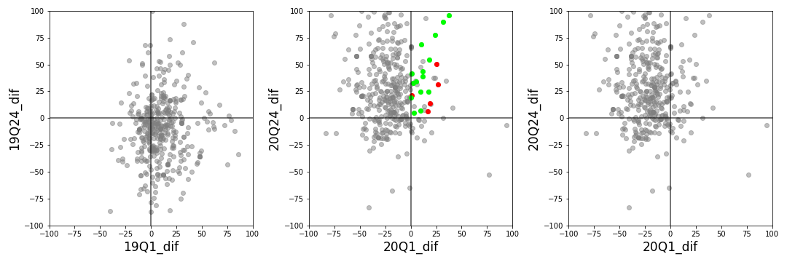

# Finding gems on polish stock market (GPW) during COVID-19 pandemic

## Intro
The global COVID-19 pandemic set everything upside down, or so it is presented in the media. The stock markets around the world were struck by the lockdown, which shows on the drops of many indexes, e.g. S&P500, DE30, WIG20. The global trend in the beginning of the year was bearish, but the markets seem more optimistic in the 3rd and 4th quarter.

Considering polish stock exchange (GPW), which companies, e.g.:
1. lost their value in 2019 but gained in 2020,
2. maintained their growth from Q2 2019 up through 2020?

## The way around this project
The information on stocks noted on GPW were taken from [their official website](https://www.gpw.pl/spolki), then each company page was scanned for short company details, etc.

The historical data on stock prices were downloaded from [Tostock repository](https://www.topstock.pl).

From these the price difference (dif) and price variance over the first quarter (Q1) and 2-4 quarter (Q24) were calculated for years 2019 and 2020.

## Gems and Gemstones

The companies which decreased their value in 2019 but gained in 2020 are marked red. The ones that kept gaining since Q2 2019 are colored lime green.

In general the top ranking companies were connected to food, software, games, medicine or construction industry.

Some of them appear frequently in recommendations as top growers, e.g. Biomed-Lublin or Opteam, but it was fun to see the noodle company at the top - Makarony Polskie. The last one grew constantly in 2020 but also had a sharp 16-33% increases in value over 2 periods:
1. beginning of march - probably due to the upcoming lockdown
2. around September 20th - probably due to the dividend (the dividend date was announced around that time as October 1st

## Closing remarks
Will be worth to see the situation unfold in the upcoming months.
